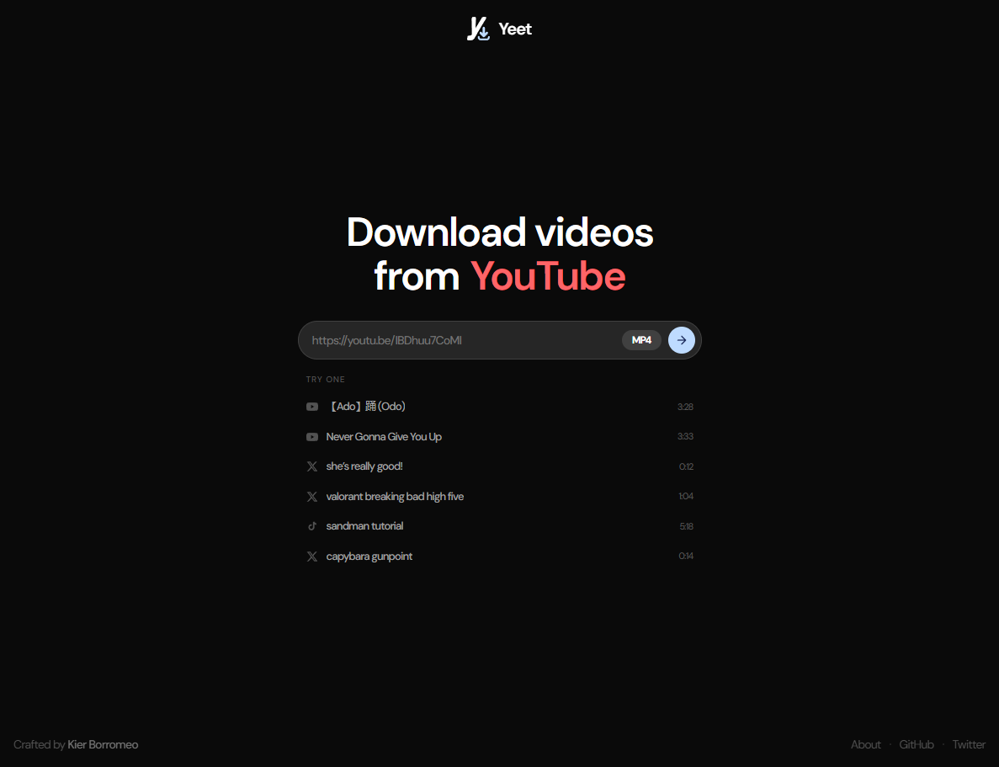

# Yeet

Download videos from YouTube, Twitter, Facebook, TikTok and Douyin.

Laravel + Inertia + React. Extraction via [yt-dlp](https://github.com/yt-dlp/yt-dlp).

## Requirements

- PHP 8.3+
- Postgres
- Node 22+
- `yt-dlp` and `ffmpeg` — ffmpeg is required to merge YouTube's separate
  video/audio streams into mp4, and to transcode mp3

```sh
brew install yt-dlp ffmpeg
```

## Setup

```sh
composer install
npm install
cp .env.example .env && php artisan key:generate
php artisan migrate
```

Set `AWS_*` in `.env` to point at your S3-compatible bucket, and `YTDLP_BINARY`
to the absolute path of yt-dlp (`which yt-dlp`) — the queue worker may not
inherit a PATH containing homebrew.

## Running

```sh
npm run dev                                  # vite
php artisan serve                            # app
php artisan queue:work --queue=downloads     # downloads run here
```

## YouTube cookies (production)

YouTube bot-checks bare datacenter IPs. Without cookies, probe/download fails with:

```text
Sign in to confirm you’re not a bot.
```

Fix: pass a Netscape cookies file from a logged-in YouTube session via
`YTDLP_COOKIES`. Use a throwaway Google account — not your main login.
[Read more in the yt-dlp docs](https://github.com/yt-dlp/yt-dlp/wiki/Extractors#exporting-youtube-cookies).

### Export on Mac

Use a Chrome profile with only the throwaway signed in. Quit Chrome (Cmd+Q),
then:

```sh
yt-dlp --cookies-from-browser "chrome:Profile 1" \
  --cookies ~/cookies.txt \
  --skip-download "https://www.youtube.com"
```

Profiles are under `~/Library/Application Support/Google/Chrome/`. If the
cookie DB is locked, Chrome is still running — kill it and retry.

### Install on the server

Put the file on shared storage so it survives deploys (Forge example):

```text
/home/forge/yeet.kierb.com/storage/app/yt-dlp-cookies.txt
```

```sh
scp ~/cookies.txt forge@YOUR_SERVER:/home/forge/yeet.kierb.com/storage/app/yt-dlp-cookies.txt
```

In `.env`:

```env
YTDLP_COOKIES=/home/forge/yeet.kierb.com/storage/app/yt-dlp-cookies.txt
```

Restart PHP and the `downloads` queue workers so they pick up the env. The
path is gitignored locally as `storage/app/yt-dlp-cookies.txt` — never commit it.

### Inspect on the server

```sh
php artisan ytdlp:check          # file path, age, each cookie name + expiry (no values)
php artisan ytdlp:check --probe  # also live-probe a public video for streams
```

Exit non-zero if the file is missing/unreadable, has no YouTube cookies, or
`--probe` gets `no_formats` / bot-check. Session health keys off
`__Secure-3PSID` / `__Secure-1PSID` / `SID` — not short-lived GPS/consent cookies.

### When it breaks again

Cookies go stale or YouTube invalidates the session. Re-export from the same
throwaway profile, replace the server file, no code change needed. Also keep
yt-dlp updated (`yt-dlp -U`).

## Douyin cookies

Douyin needs its own cookie jar. `YTDLP_COOKIES` is a youtube.com file and
yt-dlp only sends cookies matching the request host, so it never reaches
Douyin. There's no browser export and no account here — one command writes it:

```sh
php artisan ytdlp:douyin
```

Lands in `storage/app/douyin-cookies.txt` (override with `DOUYIN_COOKIES`).
Run it once per machine — `composer setup` covers local, so this is mainly a
one-off on the server. Without it, Douyin downloads throw and the exception
names this command.

Re-run with `--force` if Douyin starts refusing the cookie; it isn't routine
upkeep, the cookie's own expiry is a year out. `App\Services\DouyinCookies`
explains what Douyin is actually checking for.
